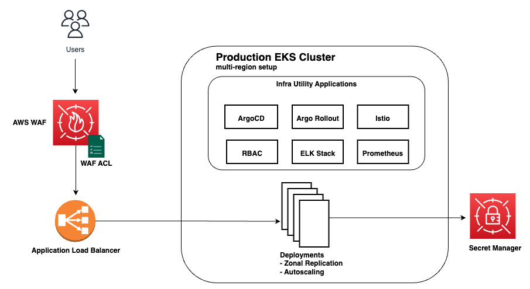
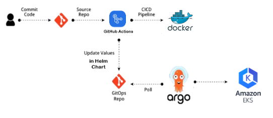

# Web Server Demo - Scalable Web Server Monitoring and Load Testing System

## Introduction
This repository contains a architecture for a scalable and secure Node application with proper GitOps practices in-place.

## Endpoints
- `/api/v1/info` - Responds with basic os level information of system (NOTE: this is just for testing - in production systems we should not expose this data)
- `/api/v1/health` - Simple healthcheck endpoint. Returns `{"success":true}`

## Architecture

Proposed High Level Architecture Diagram for production release of backend application

<p align="center"></p>

**NOTE**
- HPA is enabled on Application
- (optional) Multi-region EKS clusters could be used to support wide geographies
 
## Local Setup & Testing

### Overview

The entire setup is done using docker and docker-compose. The below-mentioned are the services being orchestrated via docker-compose:

- **backend**: container running Nodejs API server
- **prometheus**: monitoring tool for time series data
- **grafana**: data visualization platform
- **jmeter**: performance and load testing tool

Directory Structure:
- `./app`: contains demo nodejs codebase & test cases
- `./jmeter`: contains config files for jmeter load testing
- `./monitoring/prometheus`: contains scrape configurations for 
prometheus
- `./monitoring/grafana`: contains dashboards, alerts, and datasources for grafana

### Prerequisite
- Install [Docker](https://docs.docker.com/get-docker/)
- Install [docker-compose](https://docs.docker.com/compose/install/)
- (optional) Update variables in `./jmeter/jmeter.properties` for load testing

### Start Application

```bash
$ docker-compose up
```

OR in detached mode
```bash
$ docker-compose up -d
```

Output:
- APIs should be accessible at: `http://localhost:4000/`
- Grafana should be accessible at: `http://localhost:3000/`
- Jmeter should start performing load test on application and results should be published in `./jmeter/results.jtl`

### Monitoring

The below-mentioned metrics are being exposed by application:

- **up**: denotes if service is up or not. 1 = UP, 0 = NOT UP
- **http_request_duration_seconds_sum**: sum of latency per API calls
- **http_request_duration_seconds_count**: count of how many API calls were made.

Grafana should be up and running at `http://localhost:3000/`

**Dashboards**
<p></p>

**Alert**
- `HighLatency`: API latency is exceeding 150ms for more than 5 minutes.
- `Up`: checks apis status - triggers alert if API is down in last 5 minutes.

### Load Testing

[Jmeter](https://jmeter.apache.org/) is being used to perform load testing.

Configuration files:
- `./jmeter/load_test.jmx`: contains load test plan
- `./jmeter/jmeter.properties`: contains environment variables to be passed to jmeter to run test

The load test can be executed by running:
```bash
$ docker-compose up jmeter
```

The output of load testing will be stored in `./jmeter/results.jtl` file.

## Infra Setup and Production Release

### Kubernetes Deployment - Helm Charts

The `./deploy/charts` directory contains helm charts to deploy this application and it supports:

1. `HPA` based on high CPU or Memory load
2. `ExternalSecrets` to pull secrets from AWS/GCP Secret Manager, Vault, etc to ensure high security
3. `Ingress` to expose application to public via an Ingress Controller (example: [kong](https://docs.konghq.com/kubernetes-ingress-controller/latest/))
4. `AntiAffinity` to prevent running multiple replicas of backend application on same machines to ensure high-availability

### CI: Build and Publish docker image

#### (Proposed) Tools/Services:
- Container Registry: [Dockerhub](https://hub.docker.com/)
- CI/CD Tools: [Github Action](https://github.com/features/actions) and [ArgoCD](https://argo-cd.readthedocs.io/en/stable/)

#### Required Github Secrets:
- `DOCKER_USER`: username for dockerhub
- `DOCKER_PASSWORD`: password for dockerhub - used to upload docker images
- `DOCKER_REGISTRY`: name of docker registry

[WIP] Proposed Architecture for Automated Deployments using Github Action + ArgoCD

<p align="center"></p>

#### Workflows

- **Release Pipeline**: `.github/workflows/release.yaml` triggered is changes are pushed, merged on the `main` branch. It builds and pushes dockerimage to container registry.

## TODO / Future Improvements
- Support for auto-scaling based on load in docker-compose (PS: this feature is not supported yet by docker-compose [[Ref](https://github.com/docker/compose/issues/10822)])
- Setup terraform for infra provisioning
- Support to add CD to deploy application automatically once code changes are performed
- Integrate ArgoCD for automated deployments
